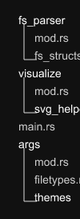

<div align="center">
  
  <h1>Glimmr</h1>
</div>

<p align="center">
  <a href="#about">About</a> •
  <a href="#features">Features</a> •
  <a href="#installation">Installation</a> •
  <a href="#usage">Usage</a> •
  <a href="#themes">Themes</a>
</p>

---

## About

Glimmr is a command-line tool that generates beautiful and customizable visualizations of your file and directory structures. It's designed to be fast, easy to use, and flexible, allowing you to create clear and aesthetically pleasing representations of your projects.

## Features

- **Directory Visualization**: Generate tree-like visualizations for any given directory.
- **Custom Themes**: Customize the look and feel of the visualization with different color themes.
- **SVG Output**: Outputs to a clean, scalable SVG file.
- **Adjustable Depth**: Control the maximum depth of the directory traversal.
- **Font Embedding**: Option to bake the font directly into the SVG for perfect rendering anywhere.
- **Transparent Background**: Option to render with a transparent background for easy integration into other media.

## Demo

<table>
  <tr>
    <td valign="top">
      <p>This visualization of the project's <code>src/</code> directory was generated with the following command:</p>
      <pre><code>glimmr src -d 1 -t default_dark</code></pre>
    </td>
    <td width="50%" align="center">

    </td>
  </tr>
</table>

## Tech-Stack

- **Language**: [Rust](https://www.rust-lang.org/)
- **Argument Parsing**: [clap](https://crates.io/crates/clap)
- **SVG Generation**: [svg](https://crates.io/crates/svg)

## Installation

Ensure you have Rust and Cargo installed. You can then install `glimmr` directly from the source:

```sh
# Clone the repository
git clone https://github.com/dabemuc/glimmr.git
cd glimmr

# Install the binary
cargo install --path .
```

## Usage

Run `glimmr` from your terminal, providing a path to the directory you want to visualize.

### Basic Example

```sh
glimmr ./my-project -o my-project.svg
```

### Options

| Flag | Long Flag           | Description                                                  | Default      |
| :--- | :------------------ | :----------------------------------------------------------- | :----------- |
|      | `input_path`        | Path to the directory to visualize                           | (Required)   |
| `-t` | `--theme`           | Theme to use. Also supports json string or path to json file | `Default`    |
| `-f` | `--filetype`        | Output filetype                                              | `SVG`        |
| `-o` | `--output-filepath` | Output filename or filepath                                  | `glimmr_out` |
| `-d` | `--depth`           | Max recursive depth                                          | `3`          |
| `-r` | `--include-root`    | Include root folder in the output                            | `false`      |
| `-b` | `--bg-transparent`  | Render with a transparent background                         | `false`      |
| `-F` | `--bake-font`       | Bake font into the SVG file                                  | `false`      |
| `-h` | `--help`            | Opens help menu                                              |              |

### Example with Options

This will generate a visualization of the `src` directory, up to 4 levels deep, with a transparent background and the font baked in.

```sh
glimmr ./src -d 4 -b -F -o src_visualization.svg
```

### Themes

Glimmr comes with several built-in themes:

- `default`
- `default_dark`
- `tokyonight`
- `dracula`
- `solarized_dark`
- `monokai`
- `nord`

You can also create your own themes by providing a path to a JSON file (or a raw JSON string) to the `--theme` argument.

#### Custom Theme Properties

The following properties are supported in a custom theme JSON file:

| Property               | Type   | Description                                                                         |
| :--------------------- | :----- | :---------------------------------------------------------------------------------- |
| `base_theme`           | string | The name of the theme thats used as a base. By default, the `default` theme is used |
| `font`                 | string | The name of the font to use (must be installed on your system).                     |
| `folder_font_size`     | number | Font size for folder names.                                                         |
| `file_font_size`       | number | Font size for file names.                                                           |
| `folder_text_color`    | string | Hex color code for folder text.                                                     |
| `file_text_color`      | string | Hex color code for file text.                                                       |
| `folder_bg_color`      | string | Hex color code for the background of folder nodes.                                  |
| `file_bg_color`        | string | Hex color code for the background of file nodes.                                    |
| `bg_color`             | string | (Optional) Hex color code for the overall SVG background.                           |
| `bg_corner_rad`        | number | Corner radius for the overall background.                                           |
| `folder_bg_corner_rad` | number | Corner radius for folder nodes.                                                     |
| `file_bg_corner_rad`   | number | Corner radius for file nodes.                                                       |
| `hierarchy_line`       | string | Style of the hierarchy lines (currently only `"Default"` is supported).             |
| `hierarchy_line_color` | string | Hex color code for the hierarchy lines.                                             |

#### JSON File Example

Create a file named `my_theme.json` with the properties you want to override. Use `base_theme` to specify a different base then `default`.

```json
{
  "base_theme": "nord",
  "font": "Ubuntu Mono",
  "file_text_color": "#eceff4",
  "folder_bg_color": "#3b4252",
  "bg_corner_rad": 5
}
```

Then run `glimmr` with the `--theme` flag pointing to your file.

```sh
glimmr ./my-project --theme ./my_theme.json
```

#### JSON String Example

Run `glimmr` with the `--theme` flag and a custom json string:

```sh
glimmr ./my-project --theme '{"file_text_color": "#eceff4"}'
```
