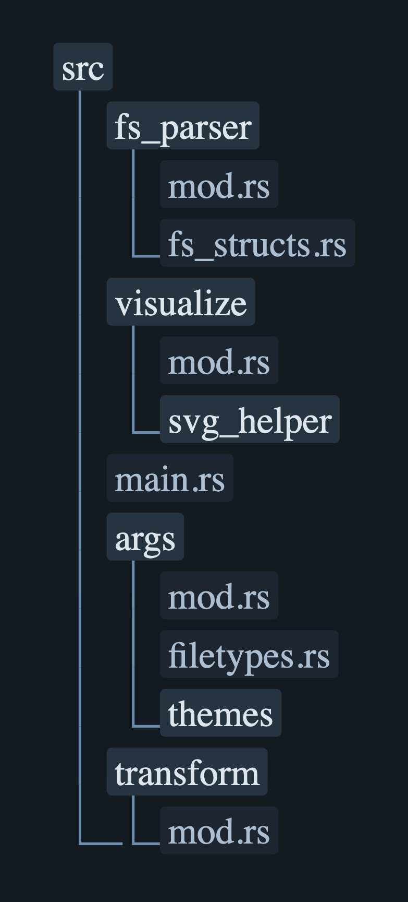

<div align="center">
  
  <h1>Glimmr</h1>
</div>

<p align="center">
  <a href="#about">About</a> •
  <a href="#features">Features</a> •
  <a href="#installation">Installation</a> •
  <a href="#usage">Usage</a> •
  <a href="#themes">Themes</a>
</p>

---

## About

Glimmr is a command-line tool that generates beautiful and customizable visualizations of your file and directory structures. It's designed to be fast, easy to use, and flexible, allowing you to create clear and aesthetically pleasing representations of your projects.

## Features

- **Tree-like directory visualizations**
- **Pre-made and custom themes**
- **Outputs to either png or svg**
- **Many settings to archive the look you want**
- **Flexible exclusion options** (e.g., `.gitignore` support, ignoring hidden files, custom excludes)
- **Folder collapsing**

## Demo

<table>
  <tr>
    <td valign="top">
      <p>This visualization of the project's <code>src/</code> directory was generated with the following command:</p>
      <pre><code>glimmr ./src -o assets/demo.png -d 1 -t nord -f png -r</code></pre>
    </td>
    <td width="50%" align="center">

    </td>
  </tr>
</table>

## Tech-Stack

- **Language**: [Rust](https://www.rust-lang.org/)
- **Argument Parsing**: [clap](https://crates.io/crates/clap)
- **SVG Generation**: [svg](https://crates.io/crates/svg)
- **PNG Generation**: [chromiumoxide](https://crates.io/crates/chromiumoxide) (headless browser automation)
- **Asynchronous Runtime**: [tokio](https://crates.io/crates/tokio) & [futures](https://crates.io/crates/futures)
- **Serialization**: [serde](https://crates.io/crates/serde) & [serde_json](https://crates.io/crates/serde_json) (for parsing custom themes)
- **Font Handling**: [font-kit](https://crates.io/crates/font-kit) & [rusttype](https://crates.io/crates/rusttype)
- **File Exclusion**: [ignore](https://crates.io/crates/ignore)

## Installation

Ensure you have Rust and Cargo installed. You can then install `glimmr` directly from source:

```sh
# Clone the repository
git clone https://github.com/dabemuc/glimmr.git
cd glimmr

# Install the binary
cargo install --path .
```

You may need to add cargos install directory to path.

## Usage

Run `glimmr` from your terminal, providing a path to the directory you want to visualize.

### Basic Example

```sh
glimmr ./my-project -o my-project.svg
```

### Options

| Flag | Long Flag            | Description                                                  | Default      |
| :--- | :------------------- | :----------------------------------------------------------- | :----------- |
|      | `input_path`         | Path to the directory to visualize                           | (Required)   |
| `-t` | `--theme`            | Theme to use. Also supports json string or path to json file | `Default`    |
| `-f` | `--filetype`         | Output filetype                                              | `SVG`        |
| `-o` | `--output-filepath`  | Output filename or filepath                                  | `glimmr_out` |
| `-d` | `--depth`            | Max recursive depth                                          | `3`          |
| `-r` | `--include-root`     | Include root folder in the output                            | `false`      |
| `-b` | `--bg-transparent`   | Render with a transparent background                         | `false`      |
| `-F` | `--bake-font`        | Bake font into the SVG file                                  | `false`      |
| `-e` | `--excludes`         | Files/Folders to exclude                                     |              |
|      | `--use-gitignore`    | Use .gitignore files for exclusion                           | `false`      |
|      | `--ignore-hidden`    | Ignore hidden files and directories                          | `false`      |
|      | `--collapse-folders` | Collapse folder paths that only contain a single folder      | `false`      |
| `-h` | `--help`             | Opens help menu                                              |              |
| `-V` | `--version`          | Displays version                                             |              |

### Example with Options

This will generate a visualization of the `src` directory, up to 4 levels deep, with a transparent background and the font baked in.

```sh
glimmr ./src -d 4 -b -F -o src_visualization.svg
```

### Themes

Glimmr comes with several built-in themes:

- `default`
- `default_dark`
- `tokyonight`
- `dracula`
- `solarized_dark`
- `monokai`
- `nord`

You can also create your own themes by providing a path to a JSON file (or a raw JSON string) to the `--theme` argument.

#### Custom Theme Properties

The following properties are supported in a custom theme JSON file:

| Property               | Type   | Description                                                                         |
| :--------------------- | :----- | :---------------------------------------------------------------------------------- |
| `base_theme`           | string | The name of the theme thats used as a base. By default, the `default` theme is used |
| `font`                 | string | The name of the font to use (must be installed on your system).                     |
| `folder_font_size`     | number | Font size for folder names.                                                         |
| `file_font_size`       | number | Font size for file names.                                                           |
| `folder_text_color`    | string | Hex color code for folder text.                                                     |
| `file_text_color`      | string | Hex color code for file text.                                                       |
| `folder_bg_color`      | string | Hex color code for the background of folder nodes.                                  |
| `file_bg_color`        | string | Hex color code for the background of file nodes.                                    |
| `bg_color`             | string | (Optional) Hex color code for the overall SVG background.                           |
| `bg_corner_rad`        | number | Corner radius for the overall background.                                           |
| `folder_bg_corner_rad` | number | Corner radius for folder nodes.                                                     |
| `file_bg_corner_rad`   | number | Corner radius for file nodes.                                                       |
| `hierarchy_line`       | string | Style of the hierarchy lines (currently only `"Default"` is supported).             |
| `hierarchy_line_color` | string | Hex color code for the hierarchy lines.                                             |

#### JSON File Example

Create a file named `my_theme.json` with the properties you want to override. Use `base_theme` to specify a different base then `default`.

```json
{
  "base_theme": "nord",
  "font": "Ubuntu Mono",
  "file_text_color": "#eceff4",
  "folder_bg_color": "#3b4252",
  "bg_corner_rad": 5
}
```

Then run `glimmr` with the `--theme` flag pointing to your file.

```sh
glimmr ./my-project --theme ./my_theme.json
```

#### JSON String Example

Run `glimmr` with the `--theme` flag and a custom json string:

```sh
glimmr ./my-project --theme '{"file_text_color": "#eceff4"}'
```
